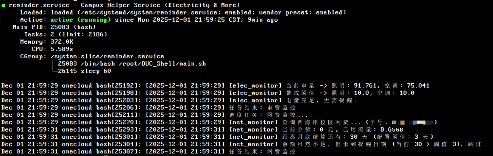

<br>
<div align="center">
    
</div>
<div align="center">
    <h1>OUC Shell</h1>
</div>
<br>
<div align="center">
    
    
    
</div>
<br>

为方便🐏大学生，爱特工作室编写了一些非常实用的Shell小程序，并且你可以非常方便地通过一个配置文件来启用和配置所有这里有的功能，而且只需要注册一个**Systemd**服务就可以实现自动化流程，非常方便

## ❗ 严正声明

本项目**仅供个人和学习使用**，禁止将本项目的代码作为商业及非法用途，禁止恶意修改本仓库代码，禁止通过本仓库代码挖掘校园网信息系统漏洞，违者将承担法律责任

## 🍕 食用方法

1.克隆本仓库

```
git clone git@github.com:ITStudioOUC/OUC_Shell.git
```

2.运行脚本

```
cd OUC_shell
bash main.sh
```

在首次运行或重新生成配置文件时，脚本会自动生成配置文件 `config.toml` ，之后脚本会自动退出，在你编辑好配置文件后重新启动脚本即可

3.注册服务 / 设置自启动

**Linux（systemd）**

- 创建服务文件
  ```
  touch /etc/systemd/system/oucshell.service
  ```
- 编辑服务文件（按实际路径替换）
  ```
  # 这只是一个systemd服务注册示例，不要直接拿来用
  [Unit]
  Description=Campus Helper Service (Electricity & More)
  After=network.target

  [Service]
  Type=simple
  User=root
  WorkingDirectory=/绝对路径/到/OUC_Shell           # 替换为你的仓库路径
  ExecStart=/bin/bash /绝对路径/到/OUC_Shell/main.sh # 替换为你的 main.sh 路径
  Restart=always
  RestartSec=10

  [Install]
  WantedBy=multi-user.target
  ```
- 启动并设置开机自启
  ```
  systemctl start oucshell.service
  systemctl enable oucshell.service
  ```

**macOS（LaunchAgent，随用户登录启动）**

- 安装依赖（macOS 自带 curl，需安装 jq 与 bc）
  ```
  brew install jq bc
  ```
- 运行脚本（首次生成 config.toml，按需填写后再运行）
  ```
  cd OUC_Shell
  bash main.sh
  ```
- 创建 LaunchAgent（把路径换成你自己的绝对路径）
  ```
  cat > ~/Library/LaunchAgents/cn.ouc.shell.plist <<'EOF'
  <?xml version="1.0" encoding="UTF-8"?>
  <!DOCTYPE plist PUBLIC "-//Apple//DTD PLIST 1.0//EN" "http://www.apple.com/DTDs/PropertyList-1.0.dtd">
  <plist version="1.0">
  <dict>
    <key>Label</key><string>cn.ouc.shell</string>
    <key>ProgramArguments</key>
    <array>
      <string>/bin/bash</string>
      <string>/绝对路径/到/OUC_Shell/main.sh</string>
    </array>
    <key>WorkingDirectory</key><string>/绝对路径/到/OUC_Shell</string>
    <key>StandardOutPath</key><string>/绝对路径/到/OUC_Shell/service.log</string>
    <key>StandardErrorPath</key><string>/绝对路径/到/OUC_Shell/service.log</string>
    <key>RunAtLoad</key><true/>
    <key>KeepAlive</key><true/>
  </dict>
  </plist>
  EOF

launchctl load ~/Library/LaunchAgents/cn.ouc.shell.plist
  ```
  - 请将 `/绝对路径/到/OUC_Shell` 替换为你的实际仓库路径（例如 `/Users/yourname/github_project/OUC_Shell`）。
  - 停止/重载：`launchctl unload ~/Library/LaunchAgents/cn.ouc.shell.plist` 后再 `load`。
- 查看运行日志
  ```
  tail -f /绝对路径/到/OUC_Shell/service.log
  ```

# 效果演示



## 🤝 贡献者

<!-- readme: contributors -start -->
<table>
	<tbody>
		<tr>
            <td align="center">
                <a href="https://github.com/Yaosanqi137">
                    
                    <br />
                    <sub><b>Yaosanqi137</b></sub>
                </a>
            </td>
		</tr>
	<tbody>
</table>
<!-- readme: contributors -end -->
